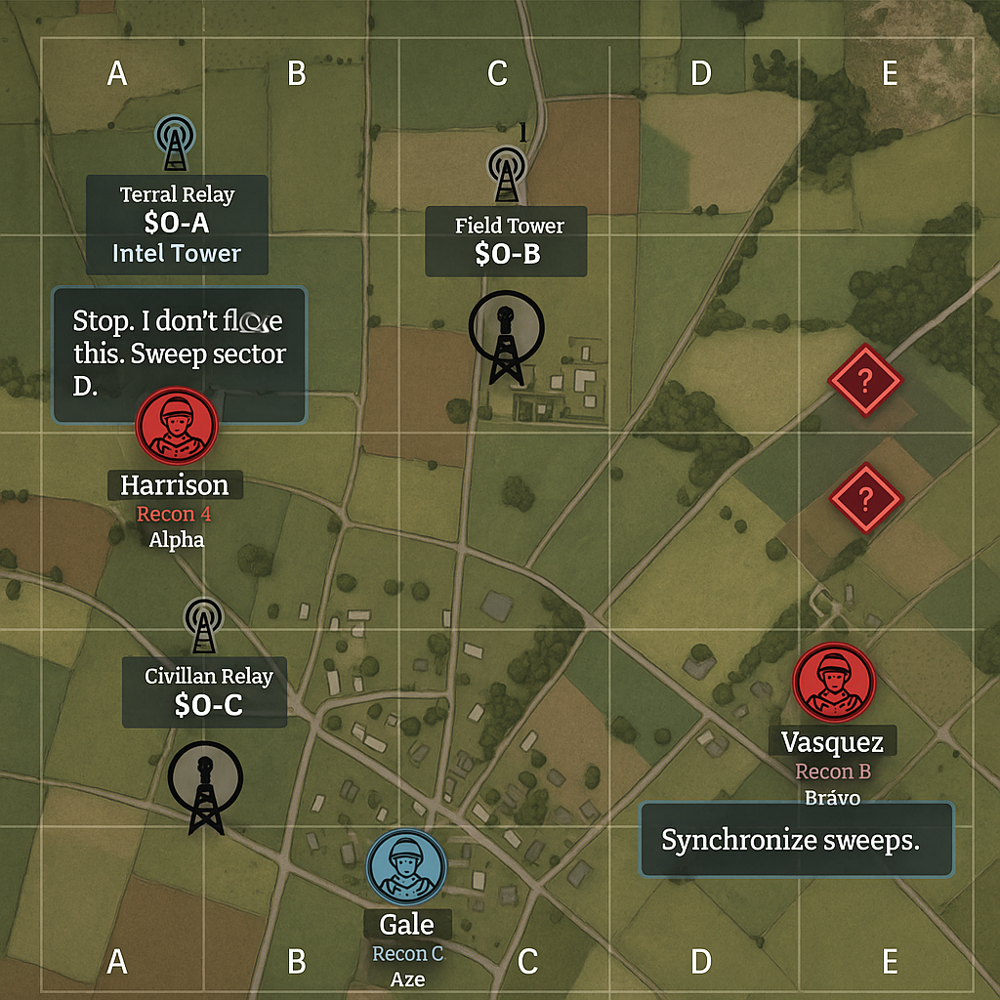
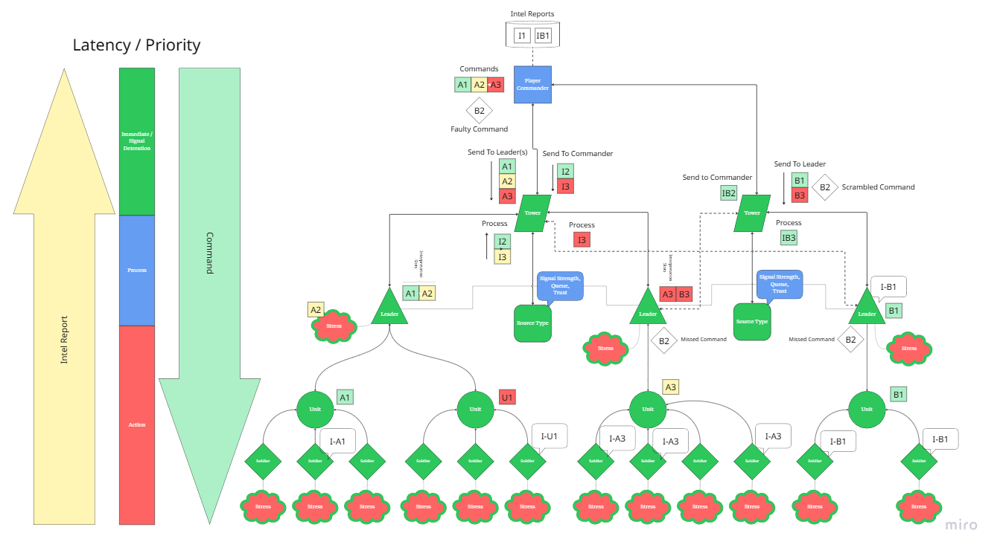
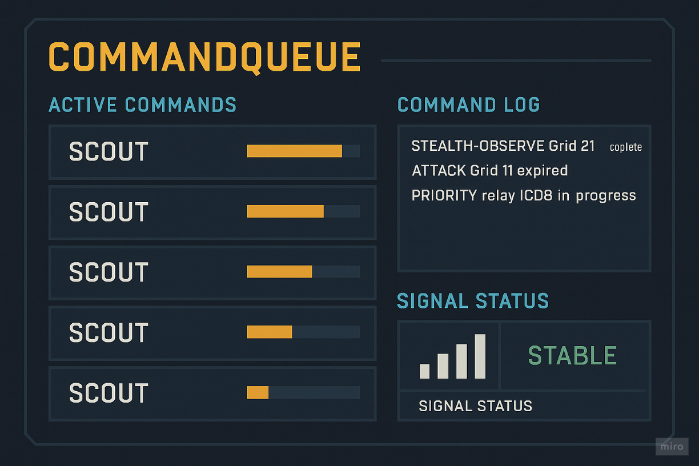
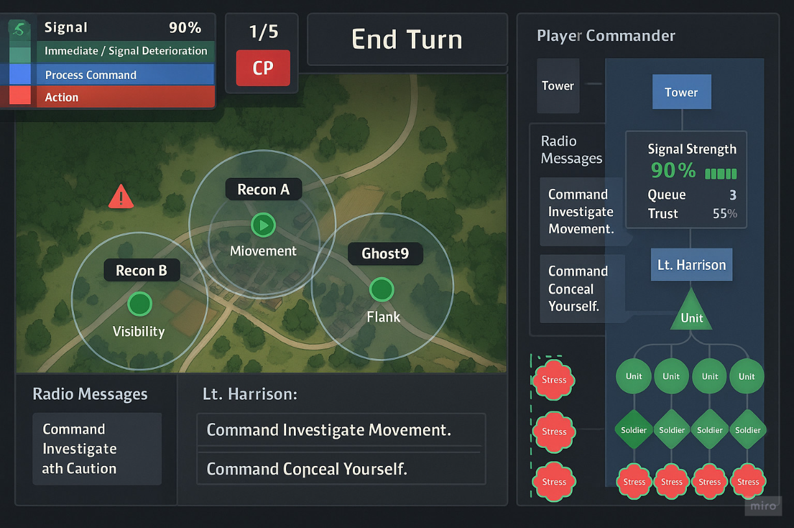

# Military Coordination - Game Design

**Genre:** Tactical Command Simulation
**Focus:** Strategic intel gathering, comms infrastructure, and resource-aware decision-making

---

**🧠 Core Premise:**
You’re the **Commander**, issuing intel-driven commands through a **SignalTower** to a chain of units managed by **Unit Leads**. Your job isn’t to shoot—it’s to *know*. The game challenges you to gather, interpret, and act on battlefield intel with imperfect tools and time pressure.

---

**🔁 Core Loop:**

1. **Issue Command** – PlayerCommand creates an objective (e.g. scout Grid-17)
2. **Relay** – SignalTower passes the command down the chain
3. **Delegate** – Unit Lead assigns the task based on status, equipment, and context
4. **Execute** – Units perform the task and gather intel
5. **Report** – Intel flows back up, mapped to the strategic view
6. **Assess** – Player adjusts strategy based on results and system status


---

**🎯 Gameplay Axes (from your quadrant design):**

* **Strategy:** Fun comes from efficient planning, delegation, and execution across systems
* **Resources:** Fun comes from managing delay, signal degradation, equipment, and unit limitations
* **Exploration:** Fun comes from learning the terrain, uncovering enemy positions, and revealing truth through recon
* **Skill:** Fun comes from mastering the loop—timing, unit coordination, and reacting under pressure

---

**🔵 Layered System Architecture:**

* **Primary Layer (Control):** PlayerCommand, SignalTower, Unit Lead, Intel
* **Secondary Layer (Execution):** Units, Status systems (signal strength, intel freshness, delay), Equipment
* **Tertiary Layer (Support & Disruption):** Alarms, global Abilities, rare modifiers that bend the rules

---

**🎮 Design Philosophy:**
Not “how fast can you act?”
But *“how clearly can you think?”*

This game rewards *awareness* over reflex, *clarity* over chaos, and makes the player feel like a true battlefield conductor—not a soldier, but the mind behind the war.

**Core Design Goals:**

* Emphasize adaptive command management over brute-force tactics
* Introduce behavioral AI elements that simulate observation and learning
* Utilize signal interference as both a thematic and mechanical constraint
* Provide a narrative framework that rewards trust, clarity, and cohesion

## 🛰 Command Queue System

### Concept

The **SignalTower** has limited bandwidth. Commands are queued, prioritized, and processed over time. This creates pressure on the player to manage urgency, queue size, and timing.

### CommandQueue Structure (Pseudocode)

```java
class CommandQueue {
    Queue<Command> queue = new LinkedList<>();
    int maxConcurrentCommands = 3;
    Duration commandTickRate = Duration.ofSeconds(5);

    void enqueue(Command cmd) {
        queue.add(cmd);
    }

    List<Command> processTick() {
        List<Command> executed = new ArrayList<>();
        for (int i = 0; i < maxConcurrentCommands && !queue.isEmpty(); i++) {
            Command c = queue.poll();
            executed.add(c); // Send to UnitLead
        }
        return executed;
    }
}
```

### Gameplay Implications

* **Tactical Pressure**: Players must choose what to send and when.
* **Delays as Gameplay**: Command timing adds strategic weight.
* **Risk vs Reward**: Preemptive, queued, or canceled commands influence battlefield outcome.

### Bonus Features

* **Command Canceling** wastes bandwidth.
* **Command Preemption** allows high-priority interruptions.
* **Command Timeout** leads to automatic failure and alert.

---

## Summary of Concepts Developed (Military Coordination Game)

* Game Theme: Military Coordination under uncertain signal conditions and unit limitations

* Player Role: Commander issuing orders through limited and interference-prone channels

* Signal Tower System: Primary relay structure critical for unit control; can be jammed, spoofed, or fail

* Chain of Command Structure: Units controlled by squad leaders who manage subordinates; leaders like Lt. Harrison and Lt. Vasquez were defined as node leaders

* Command Economy: Core mechanic where a limited number of command points must be strategically spent per turn; expanded into Adaptive Command Economy (ACE)

* Command Priority & Latency: Non-priority commands are deferred; latency system models uncertainty and field delay

* Unit Trust & Stress: Modeled behaviors that vary based on frequency of orders and distance to towers; affects command costs and reaction

* Fog of War: Visual mechanics and map overlays used to represent known/unknown areas of operation

* Intel Gathering: Units like Ghost9 specialize in discovering enemy positions and interference sources

* Narrative Layer: Echo-Red was introduced as an observing AI evaluating the commander's style; purpose unclear, possibly simulative or adversarial

* Session Flow: Players go through planning, deployment, recon, command execution, and extraction phases

* Evacuation Protocols: Missions end with a tactical withdrawal and post-mission analysis



## Key Gameplay Systems



### 1. Adaptive Command Economy (ACE)

* Players receive a base pool of 5 Command Points (CP) per turn.

* CP cost of an order depends on:
  * Unit trust level
  * Stress accumulation
  * Signal range status

* Non-priority commands are deferred through a latency stack.
* Units with high stress or low trust may reinterpret or resist commands.



### 2. Unit State Modeling

Each unit maintains:

* Trust Level (0–100): Reflects confidence in the commander
* Stress Ticks: Increases with back-to-back orders
* Signal Status: Boolean for tower connection
* Units may react differently to identical commands based on state

### 3. Signal Infrastructure

* Signal Towers (e.g., Falcon, CivicCom) establish operational integrity

* Towers can be spoofed, jammed, or overloaded

* Range and clarity impact command delivery, cost, and execution reliability

More info: [Towers](TOWERS.MD)

### 4. Observation Layer – Echo-Red

* An AI observer tracks command behavior and trust propagation

* Battlefield is partially synthetic—a training or profiling system

* Echo-Red may attempt to influence player decisions or test moral thresholds

### 5. Tactical Fog and Discovery

* Intel gathering through recon units uncovers map elements

* Unexpected interactions (e.g., spoofed civilian signals) force prioritization

* The player can choose to investigate, neutralize, or ignore events




---

## Narrative Integration

* The player discovers they are being observed through signals, behavior triggers, and intercepted data bursts

* Themes include manipulation, leadership authenticity, and synthetic morality

* Player actions feed into Echo-Red’s evolving model of command dynamics

## Victory Conditions

* Completion of primary objectives (signal disablement, intel extraction)

* Preservation of unit cohesion and minimal casualties

* Successful subversion or redirection of Echo-Red’s observation mechanism
