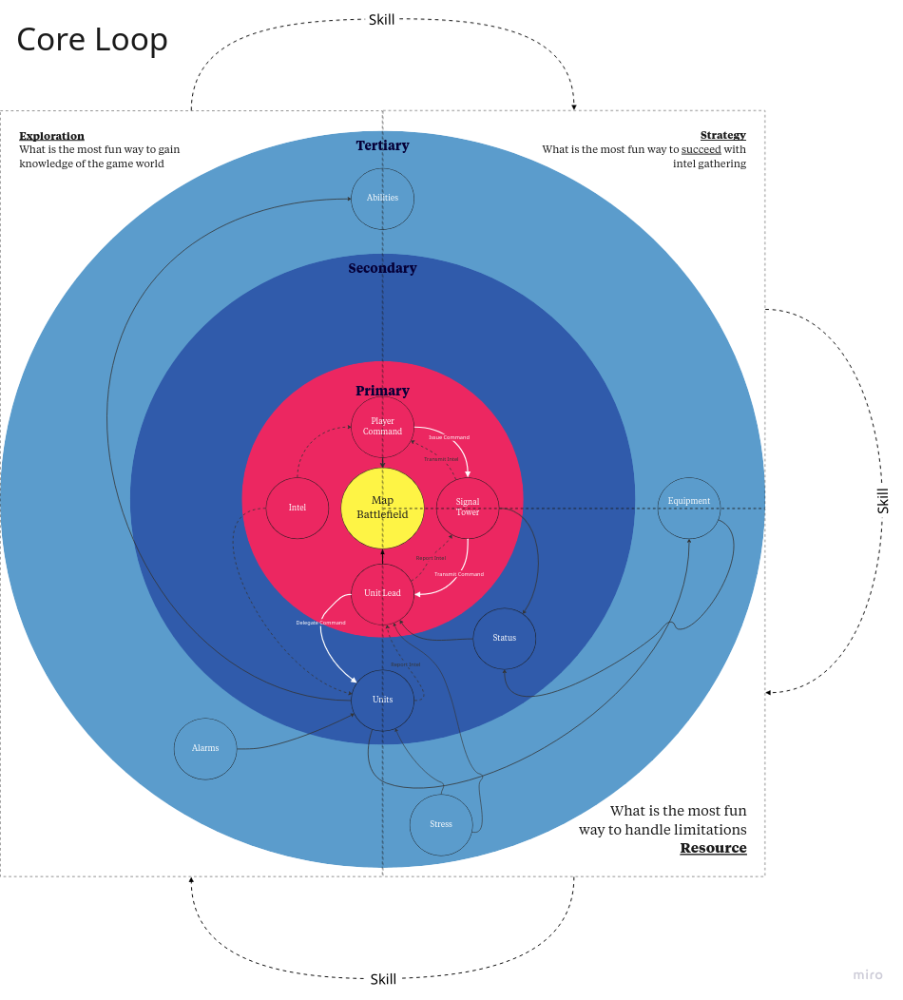

# Military Coordination - Game Design

**Genre:** Tactical Command Simulation
**Focus:** Strategic intel gathering, comms infrastructure, and resource-aware decision-making

---

**🧠 Core Premise:**
You’re the **Commander**, issuing intel-driven commands through a **SignalTower** to a chain of units managed by **Unit Leads**. Your job isn’t to shoot—it’s to *know*. The game challenges you to gather, interpret, and act on battlefield intel with imperfect tools and time pressure.

---

**🔁 Core Loop:**

1. **Issue Command** – PlayerCommand creates an objective (e.g. scout Grid-17)
2. **Relay** – SignalTower passes the command down the chain
3. **Delegate** – Unit Lead assigns the task based on status, equipment, and context
4. **Execute** – Units perform the task and gather intel
5. **Report** – Intel flows back up, mapped to the strategic view
6. **Assess** – Player adjusts strategy based on results and system status

---

**🎯 Gameplay Axes (from your quadrant design):**

* **Strategy:** Fun comes from efficient planning, delegation, and execution across systems
* **Resources:** Fun comes from managing delay, signal degradation, equipment, and unit limitations
* **Exploration:** Fun comes from learning the terrain, uncovering enemy positions, and revealing truth through recon
* **Skill:** Fun comes from mastering the loop—timing, unit coordination, and reacting under pressure

---

**🔵 Layered System Architecture:**

* **Primary Layer (Control):** PlayerCommand, SignalTower, Unit Lead, Intel
* **Secondary Layer (Execution):** Units, Status systems (signal strength, intel freshness, delay), Equipment
* **Tertiary Layer (Support & Disruption):** Alarms, global Abilities, rare modifiers that bend the rules

---

**🎮 Design Philosophy:**
Not “how fast can you act?”
But *“how clearly can you think?”*

This game rewards *awareness* over reflex, *clarity* over chaos, and makes the player feel like a true battlefield conductor—not a soldier, but the mind behind the war.

---
