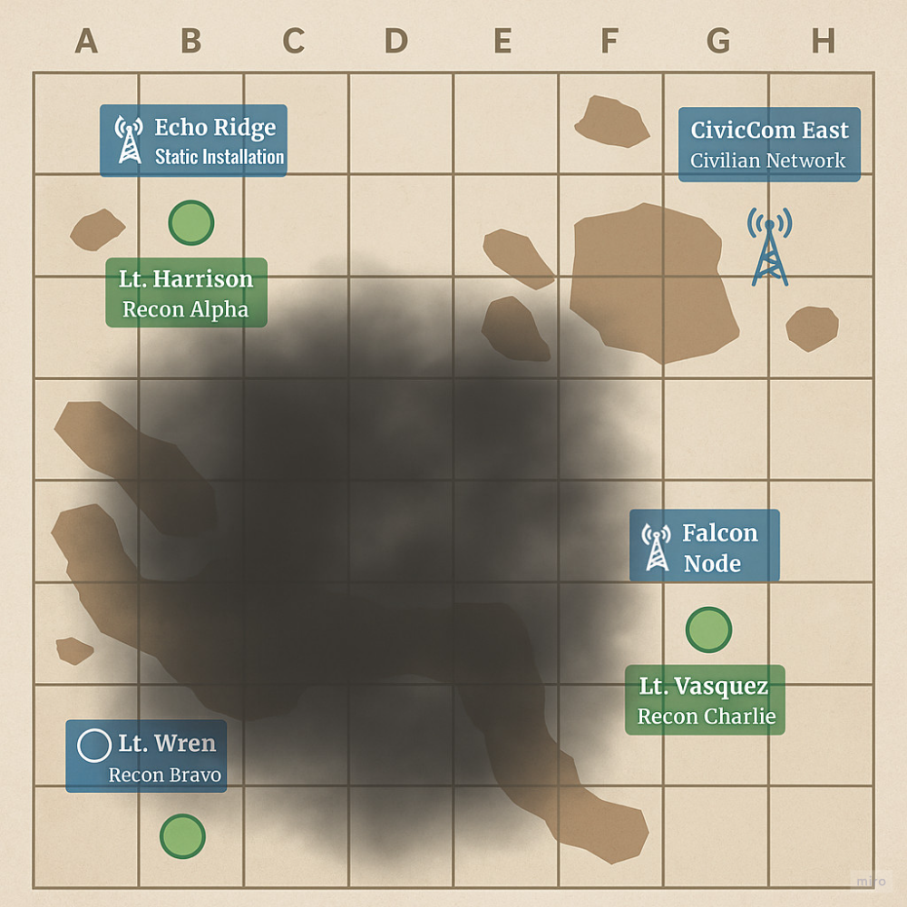
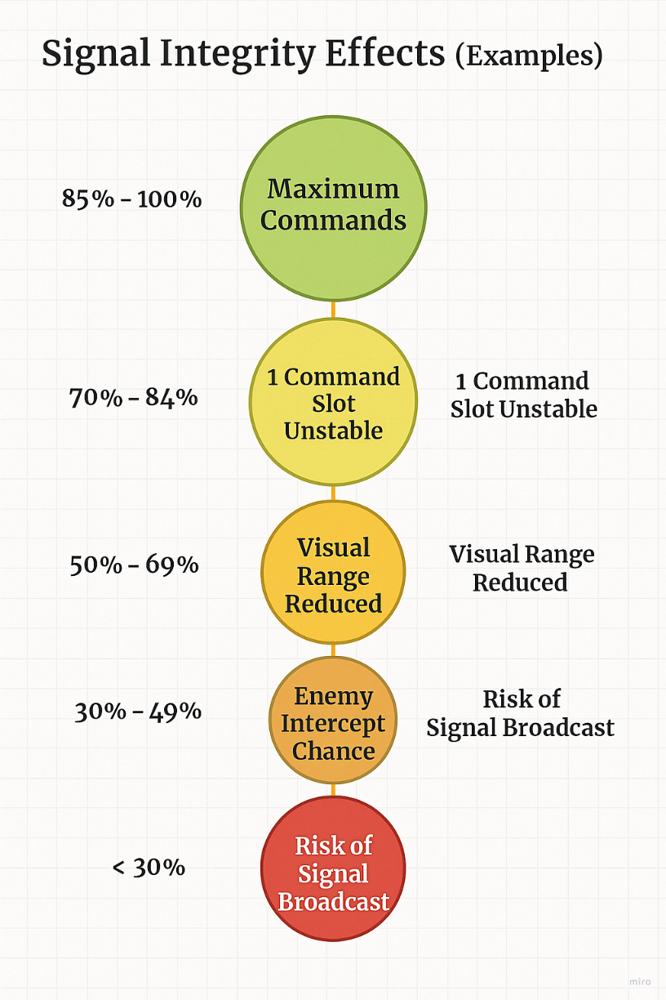

# Establishing Signal Authority: Tower Trust System™

## 1. Tower Source Type

* Static Infrastructure: Old, powerful, and potentially compromised

* Field Tower (deployed by you): Low range, high trust

* Civilian Relay: Long range, but who else is listening?

* Mobile Drone Node: Great flexibility, but fragile and limited bandwidth

Each has a signal score and a trust score—and your units may respond differently to them.

## 2. Assignment Phase (Pre-Mission)

**You choose:**

* Primary tower for coordination

* Optional backup tower if signal drops

* Who believes in which tower

**For example:**

* Vasquez only accepts orders through drone relays ("I don’t trust the static grid")

* Harrison prefers legacy infrastructure ("We used this node in '32. It never failed.")

Already, your pre-mission loadout screen has psychological weight.

## 3. Mid-Mission Doubt (Tower Spoofing Events)

**Let’s say Signal Tower A begins relaying strange pings:**

* “Change objective: Secure grid E-7.”

* “Do not engage. Units are civilians.”

**And Harrison says:**
"Sir… I received a signal from Tower A. It didn’t sound like you."

Do you trust the tower? 
Do you switch to your drone relay? 
Do you let your section leads decide—and risk divergence? 

## 4. Tower Conflict Outcomes

* Unity Bonus: All units follow one tower = strong cohesion

* Split Trust: Units interpret orders differently, leading to delays or improvisation

* Spoofed Tower Chaos: One team acts on false intel. One hesitates. One breaks protocol and exposes your op

## Tower Feedback

In order to give the player a focused view of the battlefield and how to achieve intel reports or issue strategic commands, we need to provide the Commander with clear, real-time feedback on what selected towers can achieve—and what they might fail to.

Each tower acts as a relay node, but signal fidelity is dynamic and affected by zone saturation, spoofing risk, signal alignment, and leader preferences. This mechanic is core to operational planning and mid-mission adaptation.

* **Signal Zones are divided into tiers:**

🟩 **Green Zone** – Full signal clarity, near-instant command relay, no distortion.

🟧 **Yellow Zone** – Moderate signal, introduces delay and risk of garbled commands.

🟥 **Red Zone** – Severe signal decay, increased stress, risk of interception or command override.

* **Beam Directionality** simulates 5G-like tower focus: towers can prioritize certain zones or leaders, boosting command throughput while weakening coverage elsewhere.

* **Spoof Risk** and **Backup Towers** introduce decision-making layers. Some towers might appear trustworthy but are vulnerable to interception or manipulation, impacting command authenticity and timing.

**Leader Interpretation Delay is affected by:**

* Their alignment with the selected tower.

* Signal clarity when the command is received.

* Their current stress or status condition.

When issuing commands, players will receive feedback such as:

* `Command Delivered: 100% integrity`

* `Delayed: 8s transmission loss`

* `Intercept Detected: Awaiting confirmation`

* `Leader Unresponsive: Signal Weak / Stress High`

This system forces players to own their comms network decisions and prepares them for a battlefield shaped as much by electronic warfare as by boots on the ground.

